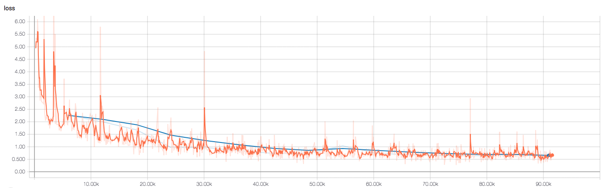
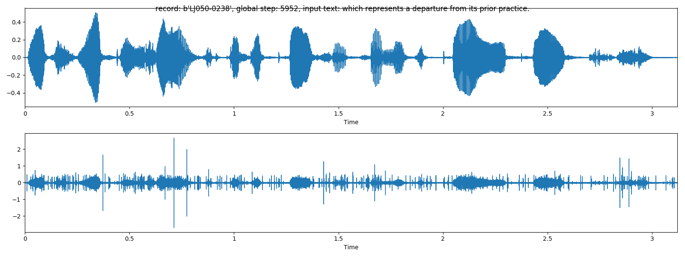
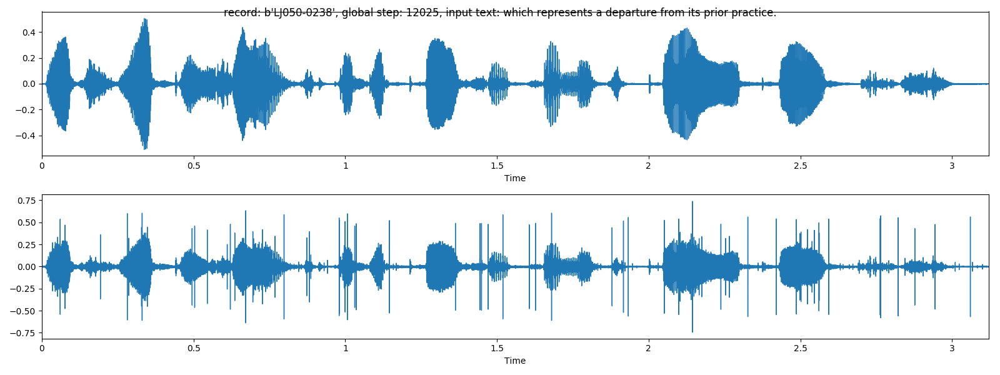
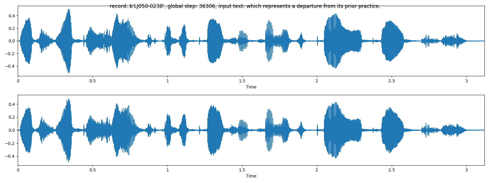
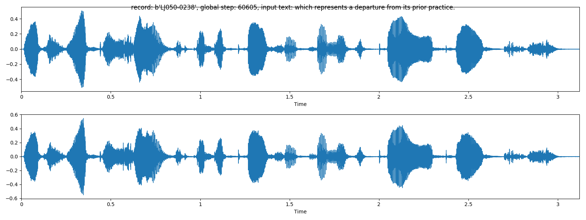
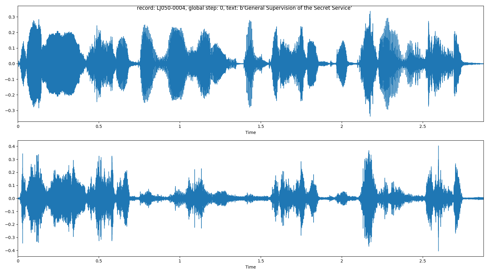

# WaveNet [](https://circleci.com/gh/TanUkkii007/wavenet)

An implementation of WaveNet: A Generative Model for Raw Audio https://arxiv.org/abs/1609.03499 .

This project is originated from the hands-on lecture of SPCC 2018.
This project rewrote codes of the lecture with following criteria:

- Simple, modular and easy to read
- Using high level tensorflow APIs: `tf.layers.Layer`, `tf.data.Dataset`, `tf.estimator.Estimator`.
- Fix discrepancy of the results between training and inference that causes workaround to dispose wrong results at early steps of inference samples.
- Review the lecture and deepen my understandings

This project has following limitations.

- Supported data set is [LJSpeech](https://keithito.com/LJ-Speech-Dataset) only
- No sophisticated initialization, optimization and regularization techniques that was in the lecture
- Lack of hyper-parameter tuning.
- Confirmed generated audio are low quality

For research-ready implementations, please refer to

- [CURRENNT_MODIFIED](https://github.com/TonyWangX/CURRENNT_MODIFIED)


This implementation was tested with Tesla K20c (4.94GiB GPU memory).

# Installing dependencies

This project requires python >= 3.6 and tensorflow >= 1.8.

The other dependencies can be installed with `conda`.

```bash
conda env create -f=environment.yml
```

The following packages are installed.

- pyspark=2.3.1
- librosa==0.6.1 
- matplotlib=2.2.2
- hypothesis=3.59.1
- docopt=0.6.2

# Pre-processing

The following pre-processing command executes mel-spectrogram extraction and serialize waveforms, mel-spectrograms and the other meta data into TFRecord (protocol buffer with content hash header) format.

```bash
python preprocess.py ljspeech /path/to/input/corpus/dir /path/to/output/dir/of/preprocessed/data
```

After pre-processing, split data into training, validation, and test sets.

A simple method to create list files is using `ls` command.

```bash
ls /path/to/output/dir/of/preprocessed/data | sed s/.tfrecord// > list.txt
```

Then split the `list.txt` into three files.

# Training

```bash
python train.py --data-root=/path/to/output/dir/of/preprocessed/data --checkpoint-dir=/path/to/checkpoint/dir --dataset=ljspeech --training-list-file=/path/to/file/listing/training/data --validation-list-file=/path/to/file/listing/validation/data --log-file=/path/to/log/file
```

You can see training and validation losses in a log file and on `tensorboard`.

```bash
tensorboard --logdir=/path/to/checkpoint/dir
```

(orange line: training loss, blue line: validation loss)



At validation time, predicted waveforms with teacher forcing are generated as images in the checkpoint directory.

(above: natural, below: predicted)

Epoch 1


Epoch 2


Epoch 6


Epoch 10



# Prediction

```bash
python predict.py --data-root=/path/to/output/dir/of/preprocessed/data --checkpoint-dir=/path/to/checkpoint/dir --dataset=ljspeech --test-list-file=/path/to/file/listing/test/data --output-dir=/path/to/output/dir
```

At prediction time, predicted samples are generated as audio files and image files.

(above: natural, below: predicted)




# Testing

Causal convolution is implemented in two different ways. At training time, causal convolution is executed in parallel with optimized cuda kernel.
At inference time, causal convolution is executed sequentially with matrix multiplication. The result of two implementation should be same. 
This project checks the equality of the two implementation with property based test.

```bash
python -m unittest ops/convolutions_test.py

python -m unittest layers/modules_test.py
```